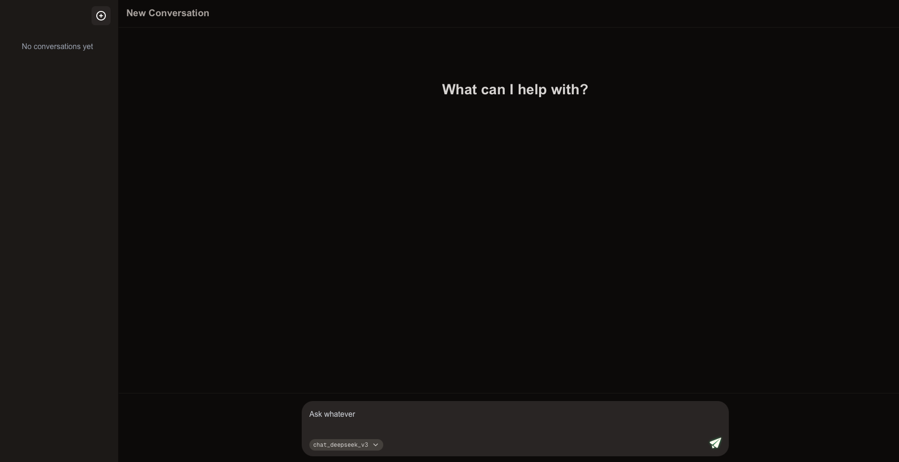

# AI Agent Chat Platform

A modern, full-stack AI agent platform featuring a sleek Next.js frontend and a powerful Python backend with multiple AI agents including research capabilities.

**Build your personal AI agent ecosystem.** This platform allows you to easily create custom LangGraph agents, deploy them using a scalable architecture, and interact with them through a beautiful chat interface. Whether you're building simple conversational agents or complex research assistants, this platform provides the foundation to bring your AI agents to life.



## 🏗️ System Architecture

This project consists of two main components that work together to provide a complete AI chat experience:

```
┌─────────────────┐    HTTPS API    ┌─────────────────┐
│   Frontend UI   │ ◄─────────────► │  Backend API    │
│   (agent_ui)    │                 │   (agent_v0)    │
│                 │                 │                 │
│ • Next.js 15    │                 │ • FastAPI       │
│ • React 19      │                 │ • LangGraph     │
│ • Tailwind CSS  │                 │ • Multiple LLMs │
│ • TypeScript    │                 │ • Research APIs │
└─────────────────┘                 └─────────────────┘
         │                                   │
         │ Database API                      │ LLM APIs
         ▼                                   ▼
┌─────────────────┐                 ┌─────────────────┐
│    Database     │                 │   AI Services   │
│   (Supabase)    │                 │                 │
│                 │                 │ • DeepInfra     │
│ • PostgreSQL    │                 │ • OpenRouter    │
│ • Real-time     │                 │ • Research API  │
│ • Authentication│                 │   (Tavily)      │
└─────────────────┘                 └─────────────────┘
```

## 📁 Project Structure

### `/agent_ui` - Frontend Application
Modern Next.js chat interface with conversation management and real-time messaging.

**Key Features:**
- 🔐 Password-protected access
- 💬 Real-time chat interface
- 📱 Responsive design (desktop & mobile)
- 🗂️ Conversation history management
- 🎨 Dark theme with modern UI
- 🔄 Multiple agent selection

### `/agent_v0` - Backend API Server
Python-based API server with multiple AI agents and research capabilities.

**Key Features:**
- 🤖 Multiple AI agents (chat, research)
- 🔍 Web search integration
- 📊 Structured report generation
- 🔑 API key authentication
- 🐳 Docker containerization
- ☁️ Cloud deployment ready

## 🛠️ Required Services

### Core Infrastructure
| Service | Purpose | Required For |
|---------|---------|--------------|
| **Vercel** | Frontend hosting | agent_ui deployment |
| **Railway** | Backend hosting | agent_v0 deployment |
| **Supabase** | Database & real-time | Conversation storage |

### AI & LLM Services
| Service | Purpose | Used By |
|---------|---------|---------|
| **DeepInfra** | DeepSeek-V3 model access | Chat agent |
| **OpenRouter** | Optimus-Alpha model access | Research agents |

### Research & Search APIs (Optional)
| Service | Purpose | Agent |
|---------|---------|-------|
| **Tavily** | Web search | Research agents |
| **Exa** | Semantic search | Research agents |
| **DuckDuckGo** | Free web search | Research agents |
| **Arxiv** | Academic papers | Research agents |

## 🚀 Quick Start

### 1. Frontend Setup (agent_ui)
```bash
cd agent_ui
cp .env.example .env.local
# Edit .env.local with your configuration
npm install
npm run dev
```

### 2. Backend Setup (agent_v0)
```bash
cd agent_v0
cp .env.example .env
# Edit .env with your API keys
pip install -r requirements.txt
python main.py
```

### 3. Database Setup
1. Create a Supabase project at [supabase.com](https://supabase.com)
2. Run the SQL schema from `agent_ui/supabase-schema.sql`
3. Update your environment variables with Supabase credentials

## 🔧 Configuration

### Frontend Environment Variables
```env
NEXT_PUBLIC_SUPABASE_URL=your_supabase_project_url
NEXT_PUBLIC_SUPABASE_ANON_KEY=your_supabase_anon_key
NEXT_PUBLIC_AGENT_API_URL=your_agent_api_url
NEXT_PUBLIC_AGENT_API_KEY=your_agent_api_key
NEXT_PUBLIC_APP_PASSWORD=your_app_password
```

### Backend Environment Variables
```env
DEEPINFRA_API_TOKEN=your_deepinfra_token
API_KEY=your_api_key
OPENROUTER_API_KEY=your_openrouter_key
TAVILY_API_KEY=your_tavily_key
```

## 🤖 Available Agents

### Chat Agent (`chat_deepseek_v3`)
- **Model:** DeepSeek-V3-0324
- **Purpose:** General conversation and assistance
- **Features:** Context-aware responses, conversation memory

### Research Agent (`deepresearch_optimus_alpha`)
- **Model:** Optimus-Alpha via OpenRouter
- **Purpose:** Advanced research and report generation
- **Features:** Multi-step research, web search, structured reports

## 🔒 Security Features

- **API Key Authentication:** Secure backend access
- **Password Protection:** Frontend access control
- **Environment Variables:** Secure credential management
- **CORS Configuration:** Controlled cross-origin requests
- **Input Validation:** Request sanitization and validation

## 📖 Detailed Documentation

For detailed setup instructions and advanced configuration:

- **Frontend:** See [agent_ui/README.md](./agent_ui/README.md)
- **Backend:** See [agent_v0/README.md](./agent_v0/README.md)

## 🚢 Deployment

### Production Deployment Stack
- **Frontend:** Deployed on Vercel with automatic deployments
- **Backend:** Containerized and deployed on Railway
- **Database:** Managed PostgreSQL on Supabase
- **CDN:** Global distribution via Vercel Edge Network

### Scaling Considerations
- **Frontend:** Serverless scaling via Vercel
- **Backend:** Horizontal scaling on Railway
- **Database:** Automatic scaling with Supabase
- **AI APIs:** Rate limiting and usage monitoring

## 📝 License

MIT License - see individual component READMEs for more details.

## 🤝 Contributing

1. Fork the repository
2. Create a feature branch
3. Make your changes
4. Test thoroughly
5. Submit a pull request

## 📞 Support

For questions, issues, or feature requests, please:
1. Check the component-specific READMEs
2. Review the debugging documentation
3. Open an issue on GitHub

---

**Built with ❤️ using modern web technologies and AI capabilities.**
